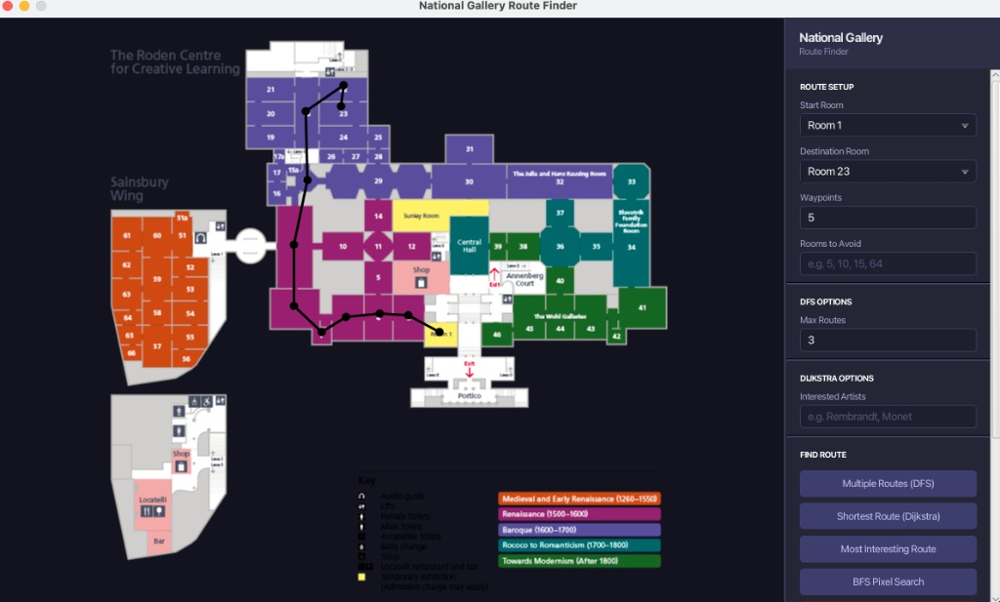
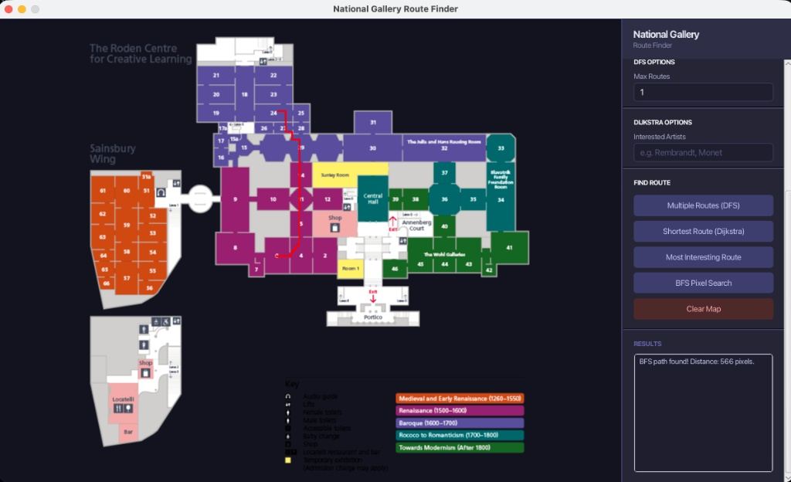

# National Gallery Route Finder

## Overview
A JavaFX application that models rooms, exhibits, doorways, and corridors in the National Gallery using a custom graph data structure to generate and visualize optimal visitor routes.

## Features
* Calculates shortest and curated routes using **Dijkstra's algorithm**
* Generates multiple route permutations using **Depth-First Search (DFS)**
* Implements pixel-based floorplan pathfinding using **Breadth-First Search (BFS)**
* Supports custom waypoints and dynamic avoidance of selected rooms/exhibits
* Renders interactive visual paths directly on a JavaFX GUI floorplan map
* Benchmarked key operations using **JMH** and fully tested with **JUnit**

## Technologies
* Java
* JavaFX
* JUnit
* JMH
* Apache Maven

## Algorithms & Concepts
* Custom Graph Data Structure
* Dijkstra's Algorithm
* Depth-First Search (DFS)
* Breadth-First Search (BFS)
* Dynamic Waypoints & Obstacle Avoidance

## Example Output

### Node Route Navigation & Waypoint Search
Calculates paths through gallery nodes with support for custom waypoints and room avoidance filters.

### BFS Pixel-Based Search
Executes pixel-level pathfinding over floorplan image overlays to calculate exact distance metrics.

## Notes
This project was developed as part of a Data Structures & Algorithms module (Semester 4 team project) and achieved 91%.
